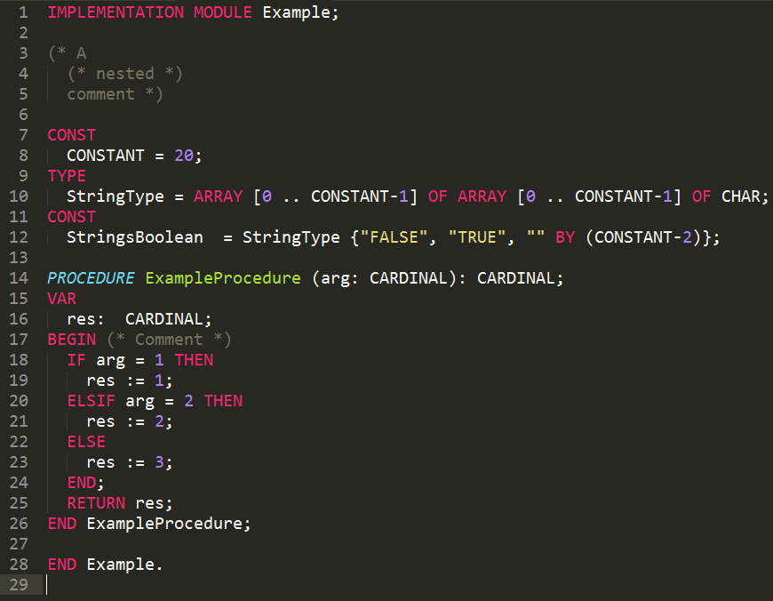

# Modula 2 Syntax for Sublime Text 3 #

The sublime-package file necessary for having the syntax highlighted and colored for Modula 2 programming language. It includes the new keywords, the new comment syntax and also supports nested comments.

## Installation ##

Just download the file Modula2.sublime-package and move it to the folder Packages of your Sublime Text 3 installation folder.

I think is necessary to install [Package Control](https://sublime.wbond.net/installation) first.

## Contribute ##

If you want to edit the syntax, the sublime-package file is like a zip file. Extract its content and modify the files.
